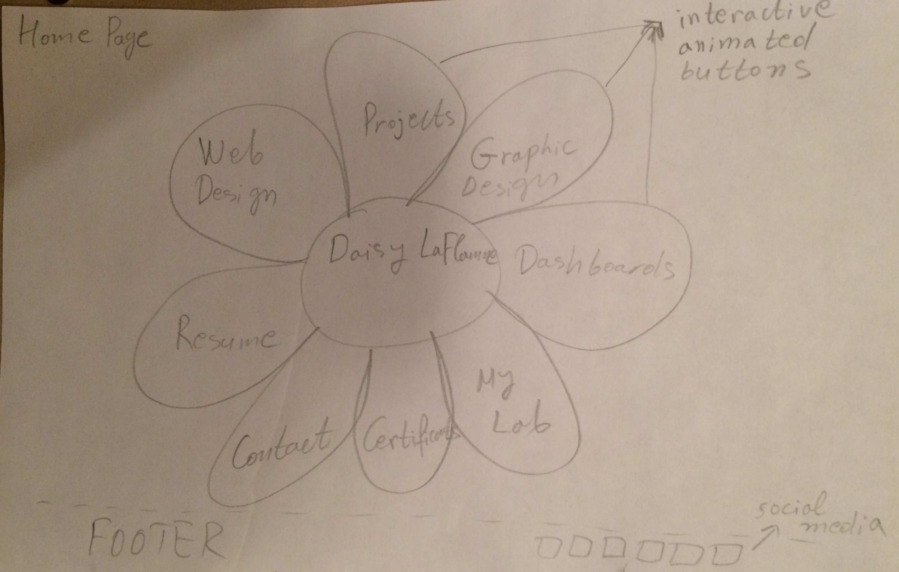

Final-project
=============

Lab questions - May 1:

1. The person who will use my project is: clients(current/future); recruiters; future employers; friends.

2. These people will be happy my project exist if:
     - they are able to find all the info they need;
     - they are impressed of the interactions and the uniqueness of it;
     - they can browse my lab;

3. The first 10 min interacting with my project will look like:
     - home page: interacting with the flower navigation;
     - looking at my resume extracted from linkedin with an API;
     - looking at my projects;
     - looking at my social network widgets: interactive data visualized using APIs and processing;

4. By the able of tonight I would like to be able to complete big part of the home page and the navigation for the other pages.

Questions:
I did not get any question

==============

Ideas for the final project:

Professional portfolio with animations, and social media APIs.

Motivation: For a long time I am planning to update my outdated professional portfolio. I want to use what I learned in this class to redesign my portfolio. Specificly, I want to use css animations, canvas with processing, and APIs of Linkedin, Tweeter, Google, Facebook and maybe others.

Goal: I want to impress the viewers of my portfolio.

Audience: current customers, future customers, recruiters, future employers, friends, professional network.

Functional specifications:
* Animated navigation on the home page: Each navigational button will be an interactive leave of a flower;
* APIs: I want to have social media widgets in the contact page;
* APIs: I want to visualize with processing my comunication/network.
* Responsive designs

